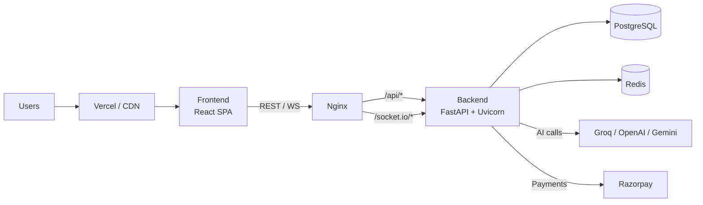
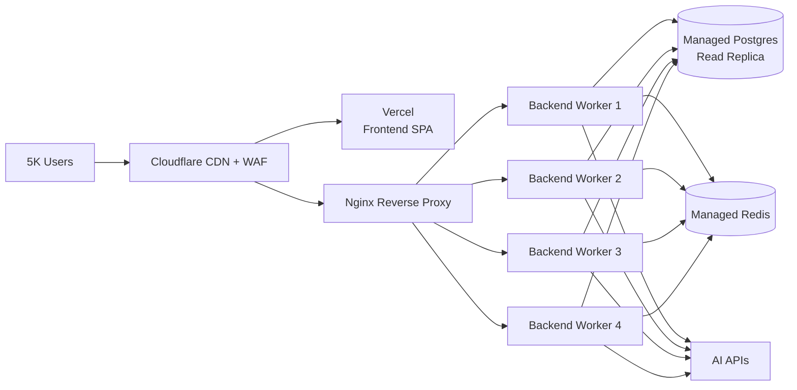
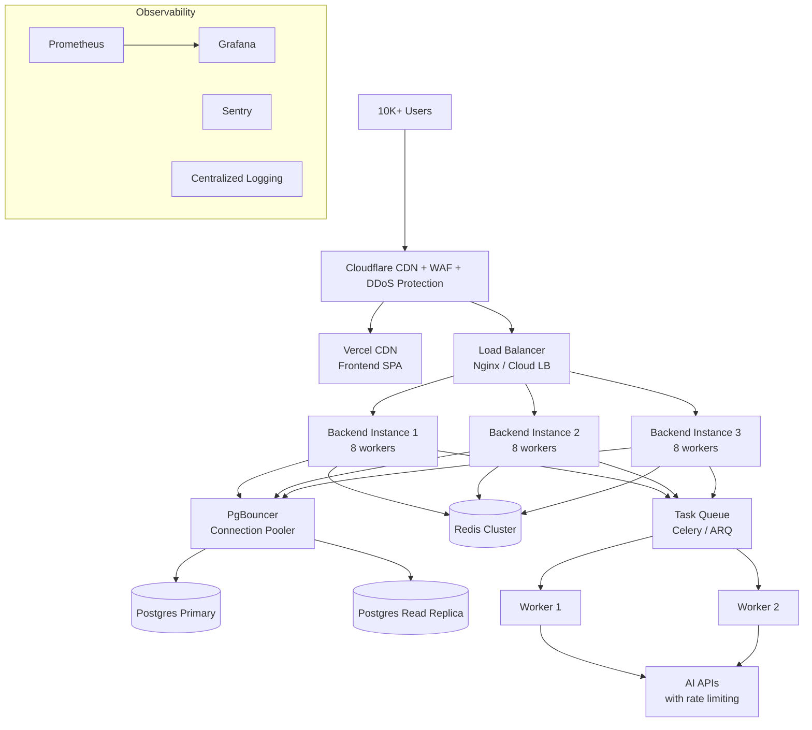

# Optileno — Deployment Readiness & Scaling Roadmap

> **Audience**: Founder / Operator  
> **Last updated**: 2026-02-17  
> **Current stack**: FastAPI · React (Vite) · PostgreSQL · Redis · Socket.IO · Nginx · Docker

---

## Architecture Overview



---

## Pre-Launch Checklist (✅ = Already Done)

| Area | Item | Status |
|------|------|--------|
| **Backend** | Health endpoints (`/health`, `/health/ready`, `/health/full`) | ✅ |
| **Backend** | Prometheus metrics (`/metrics`) | ✅ |
| **Backend** | Graceful lifespan startup/shutdown | ✅ |
| **Backend** | Global exception handler with CORS headers | ✅ |
| **Backend** | CSRF / Security headers / Rate-limit middleware | ✅ |
| **Backend** | Redis-backed distributed rate limiter | ✅ |
| **Backend** | DB connection pooling (asyncpg) | ✅ |
| **Backend** | Non-root Docker user | ✅ |
| **Backend** | Alembic migrations auto-run on deploy | ✅ |
| **Backend** | Worker auto-sizing in `start.sh` | ✅ |
| **Frontend** | Code-splitting (vendor / charts / UI chunks) | ✅ |
| **Frontend** | Multi-stage Docker build (Node → Nginx) | ✅ |
| **Frontend** | Env-based API URL configuration | ✅ |
| **Infra** | Docker Compose prod with Nginx, Postgres, Redis | ✅ |
| **Infra** | Nginx gzip, WebSocket proxy, rate-limit zones | ✅ |
| **Infra** | Postgres tuned (shared_buffers, wal, connections) | ✅ |
| **Infra** | Redis with LRU eviction + AOF persistence | ✅ |
| **Infra** | render.yaml for Render deployment | ✅ |
| **Security** | JWT authentication with httpOnly cookies | ✅ |
| **Security** | CORS whitelist with regex support | ✅ |
| **Security** | GZip middleware | ✅ |
| **Legal** | Terms of Service & Privacy Policy pages | ✅ |

> [!TIP]
> The application already has **enterprise-grade infrastructure**. No major rewrites are needed — just configuration tuning and infrastructure sizing.

---

## Stage 1: Launch Ready — 200–300 Users

**Goal**: Get into production for initial users. This is where you are now.

### Infrastructure Required

| Service | Recommended Provider | Plan | Est. Monthly Cost |
|---------|---------------------|------|-------------------|
| **Backend** | Railway | Hobby → Pro ($5–20/mo) | $5–20 |
| **Database** | Railway Postgres | Hobby (1 GB, shared) | $5 |
| **Redis** | Railway Redis | Hobby (25 MB) | $0–5 |
| **Frontend** | Vercel | Free (Hobby) | $0 |
| **Domain** | Cloudflare | — | $10–15/yr |
| **SSL** | Cloudflare (free) or Let's Encrypt | — | $0 |
| **AI APIs** | Groq / OpenAI | Pay-as-you-go | $5–20 |
| | | **Total** | **~$25–65/mo** |

### Configuration

```env
# Backend (Railway)
ENVIRONMENT=production
WORKERS_PER_CORE=2
MAX_WORKERS=2            # Railway Hobby has 1 vCPU
WEB_CONCURRENCY=2
DB_POOL_SIZE=5
DB_MAX_OVERFLOW=5
REDIS_MAX_CONNECTIONS=50
WEBSOCKET_MAX_CONNECTIONS=500
ENABLE_DOCS=false
COOKIE_SECURE=true
```

### Action Items

| # | Action | Priority |
|---|--------|----------|
| 1 | **Deploy backend to Railway** — push to GitHub, connect repo, set env vars | 🔴 Critical |
| 2 | **Deploy frontend to Vercel** — connect GitHub, set `VITE_API_URL` and `VITE_SOCKET_URL` | 🔴 Critical |
| 3 | **Provision Railway Postgres** — auto-creates `DATABASE_URL` env var | 🔴 Critical |
| 4 | **Provision Railway Redis** — auto-creates `REDIS_URL` env var | 🔴 Critical |
| 5 | **Set CORS_ORIGINS** to your Vercel domain (e.g., `["https://optileno.vercel.app"]`) | 🔴 Critical |
| 6 | **Set PRODUCTION_FRONTEND_URL** in backend env | 🔴 Critical |
| 7 | **Set all API keys** — `GROQ_API_KEY`, `SECRET_KEY`, `OWNER_EMAIL` | 🔴 Critical |
| 8 | **Configure Razorpay** — set webhook URL to `https://your-domain/api/v1/payments/webhook` | 🟡 High |
| 9 | **Verify health endpoint** — `GET https://your-backend.railway.app/health` returns 200 | 🟡 High |
| 10 | **Test full user flow** — Register → Login → AI Chat → Create task → Complete task → Analytics | 🟡 High |
| 11 | **Set up Cloudflare** — DNS proxy for your custom domain, enable "Full (strict)" SSL | 🟢 Medium |
| 12 | **Remove debug files** from repo (`.db` files, `test_*.py` scripts, log files) | 🟢 Medium |

### What to Monitor

- Railway dashboard CPU/RAM usage
- Backend logs for 500 errors: `railway logs`
- WebSocket connection count via `/health/full`
- Postgres connection utilization

---

## Stage 2: Growing — 1,000 Users

**Goal**: Handle 10x growth with minimal architectural changes.

### Infrastructure Upgrades

| Service | Change | New Plan | Est. Monthly Cost |
|---------|--------|----------|-------------------|
| **Backend** | Upgrade to Railway Pro | Pro (8 GB RAM, 8 vCPU) | $20–50 |
| **Database** | Upgrade to dedicated Postgres | Railway Pro or Supabase Pro | $25 |
| **Redis** | Upgrade to 256 MB+ | Railway Pro | $10 |
| **Frontend** | Stay on Vercel (may upgrade to Pro if bandwidth exceeds free tier) | Vercel Pro | $0–20 |
| **Monitoring** | Add Uptime Robot or BetterStack | Free tier | $0 |
| **AI APIs** | Increased usage | Pay-as-you-go | $30–80 |
| | | **Total** | **~$85–185/mo** |

### Configuration Changes

```diff
# Backend env updates for 1K users
-MAX_WORKERS=2
+MAX_WORKERS=4
-WEB_CONCURRENCY=2
+WEB_CONCURRENCY=4
-DB_POOL_SIZE=5
+DB_POOL_SIZE=10
-DB_MAX_OVERFLOW=5
+DB_MAX_OVERFLOW=10
-REDIS_MAX_CONNECTIONS=50
+REDIS_MAX_CONNECTIONS=200
-WEBSOCKET_MAX_CONNECTIONS=500
+WEBSOCKET_MAX_CONNECTIONS=2000
```

### Action Items

| # | Action | Priority |
|---|--------|----------|
| 1 | **Upgrade Railway plan** to Pro for more CPU/RAM | 🔴 Critical |
| 2 | **Upgrade Postgres** to dedicated instance (Railway Pro or Supabase Pro) | 🔴 Critical |
| 3 | **Enable automated backups** on Postgres (Railway Pro has daily snapshots) | 🔴 Critical |
| 4 | **Set up uptime monitoring** — BetterStack/UptimeRobot hitting `/health` every 60s | 🟡 High |
| 5 | **Set up error tracking** — Sentry (free plan: 5K events/mo) on both frontend and backend | 🟡 High |
| 6 | **Add CDN caching** — Cloudflare page rules for static assets (1yr cache) | 🟡 High |
| 7 | **Review AI API costs** — consider batching analytics calculations to off-peak hours | 🟢 Medium |
| 8 | **Set up log retention** — pipe Railway logs to a log aggregator (Logtail free tier) | 🟢 Medium |
| 9 | **Run a basic load test** — 100 concurrent users with k6 or Artillery | 🟢 Medium |

### Database Considerations

```sql
-- Add indexes for common query patterns at 1K users
CREATE INDEX CONCURRENTLY idx_tasks_user_status ON tasks(user_id, status);
CREATE INDEX CONCURRENTLY idx_tasks_user_due ON tasks(user_id, due_date);
CREATE INDEX CONCURRENTLY idx_plans_user_type ON plans(user_id, plan_type);
CREATE INDEX CONCURRENTLY idx_analytics_user_created ON analytics_events(user_id, created_at);
```

---

## Stage 3: Scaling — 5,000 Users

**Goal**: Handle 5K+ concurrent users. This is where you move from "single box" to "production-grade" infra.

### Infrastructure Upgrades

| Service | Change | New Setup | Est. Monthly Cost |
|---------|--------|-----------|-------------------|
| **Backend** | Migrate to **VPS** (DigitalOcean/Hetzner) or keep Railway Pro with larger instance | 4 vCPU / 8 GB RAM VPS | $40–80 |
| **Database** | **Managed Postgres** — Supabase Pro, Railway Pro, or DigitalOcean Managed DB | 4 GB RAM, 2 vCPU | $50–100 |
| **Redis** | **Managed Redis** — Upstash (serverless) or Railway dedicated | 1 GB | $10–25 |
| **Frontend** | Vercel Pro (unlimited bandwidth) | Pro plan | $20 |
| **Monitoring** | Prometheus + Grafana (self-hosted) or Datadog Lite | — | $0–25 |
| **Error Tracking** | Sentry Team plan | — | $26 |
| **AI APIs** | Increased usage, consider caching AI responses | — | $100–300 |
| **Email** | SendGrid Pro or Resend | — | $20 |
| | | **Total** | **~$270–600/mo** |

### Architecture Changes



### Configuration Changes

```diff
# Backend env updates for 5K users
-MAX_WORKERS=4
+MAX_WORKERS=8
-WEB_CONCURRENCY=4
+WEB_CONCURRENCY=8
-DB_POOL_SIZE=10
+DB_POOL_SIZE=20
-DB_MAX_OVERFLOW=10
+DB_MAX_OVERFLOW=10
-REDIS_MAX_CONNECTIONS=200
+REDIS_MAX_CONNECTIONS=500
-WEBSOCKET_MAX_CONNECTIONS=2000
+WEBSOCKET_MAX_CONNECTIONS=10000

# Add these new env vars
+UVICORN_BACKLOG=4096
+UVICORN_TIMEOUT_KEEP_ALIVE=10
+UVICORN_LIMIT_CONCURRENCY=2500
+UVICORN_LIMIT_MAX_REQUESTS=20000
```

### Action Items

| # | Action | Priority |
|---|--------|----------|
| 1 | **Deploy with full Docker Compose prod** — use `docker-compose.prod.yml` on a VPS | 🔴 Critical |
| 2 | **Use managed Postgres** — enable connection pooling (PgBouncer) if available | 🔴 Critical |
| 3 | **Add Postgres read replica** for analytics/reporting queries | 🟡 High |
| 4 | **Enable Cloudflare WAF** — protect against DDoS and bot traffic | 🟡 High |
| 5 | **Set up Prometheus + Grafana** — scrape `/metrics` endpoint, create dashboards | 🟡 High |
| 6 | **Add AI response caching** — cache identical AI analytics queries in Redis (5min TTL) | 🟡 High |
| 7 | **Implement WebSocket sticky sessions** if running multiple backend instances | 🟡 High |
| 8 | **Run staged load tests** — 500, 1K, 2K, 5K concurrent (see existing `SCALING_5K.md`) | 🟡 High |
| 9 | **Set up CI/CD pipeline** — GitHub Actions for auto-deploy on merge to `main` | 🟢 Medium |
| 10 | **Database query audit** — identify slow queries with `pg_stat_statements` | 🟢 Medium |
| 11 | **Background job queue** — move analytics recalculation to async workers (Celery/ARQ) | 🟢 Medium |
| 12 | **Add swap** to VPS for memory spikes (see DEPLOYMENT.md instructions) | 🟢 Medium |

### Postgres Tuning (for 4 GB RAM managed instance)

Already configured in `docker-compose.prod.yml`, but verify these on your managed DB:

```ini
max_connections = 300
shared_buffers = 512MB
effective_cache_size = 1536MB
maintenance_work_mem = 128MB
work_mem = 4MB
random_page_cost = 1.1
```

---

## Stage 4: Scale — 10,000+ Users

**Goal**: Handle 10K+ concurrent users. This requires horizontal scaling and a mature ops practice.

### Infrastructure Upgrades

| Service | Change | New Setup | Est. Monthly Cost |
|---------|--------|-----------|-------------------|
| **Backend** | **Horizontal scaling** — 2-3 instances behind a load balancer | 2–3 × 4 vCPU / 8 GB VPS, or Kubernetes | $120–250 |
| **Database** | **Managed Postgres (HA)** — primary + standby + read replica | 8 GB RAM, 4 vCPU | $100–200 |
| **Redis** | **Redis Cluster** or managed Redis (Upstash Enterprise / ElastiCache) | 2–4 GB | $30–60 |
| **Frontend** | Vercel Pro or self-hosted on CDN (Cloudflare Pages) | — | $20 |
| **Load Balancer** | Nginx on dedicated instance, or cloud LB (DO Load Balancer) | — | $12–20 |
| **Monitoring** | Grafana Cloud or Datadog | — | $25–50 |
| **Error Tracking** | Sentry Business | — | $80 |
| **AI APIs** | High usage, must implement request queuing and cost controls | — | $300–1000 |
| **Email** | SendGrid Pro (100K emails/mo) | — | $30 |
| **Backups** | Automated daily + weekly off-site | — | $10 |
| | | **Total** | **~$730–1700/mo** |

### Architecture Changes



### Key Architectural Changes at 10K+

| Change | Why |
|--------|-----|
| **Multiple backend instances** | Single instance maxes out at ~5K concurrent; horizontal scaling distributes load |
| **PgBouncer** | Pools DB connections across instances; prevents `max_connections` exhaustion |
| **Redis Cluster** | Single Redis node becomes a bottleneck; cluster enables sharding and HA |
| **Background task queue** | AI API calls and analytics recalculation must not block HTTP workers |
| **WebSocket pub/sub via Redis** | When running multiple backend instances, Socket.IO must use Redis adapter for cross-instance messaging |
| **Read replicas** | Analytics/reporting queries separated from transactional writes |
| **Centralized logging** | With 3+ instances, you need a single pane of glass for logs and alerting |

### Configuration Changes

```diff
# Backend env at 10K+ scale (per instance)
-MAX_WORKERS=8
+MAX_WORKERS=8        # Keep per-instance; scale via more instances
-DB_POOL_SIZE=20
+DB_POOL_SIZE=10      # Reduce per-instance; PgBouncer manages total pool
-DB_MAX_OVERFLOW=10
+DB_MAX_OVERFLOW=5
+DB_POOL_PRE_PING=true
-REDIS_MAX_CONNECTIONS=500
+REDIS_MAX_CONNECTIONS=200   # Per instance; cluster handles distribution
-WEBSOCKET_MAX_CONNECTIONS=10000
+WEBSOCKET_MAX_CONNECTIONS=5000  # Per instance
```

### Action Items

| # | Action | Priority |
|---|--------|----------|
| 1 | **Add Redis adapter to Socket.IO** — enables cross-instance WebSocket messaging | 🔴 Critical |
| 2 | **Deploy PgBouncer** — connection pooler in front of Postgres | 🔴 Critical |
| 3 | **Set up load balancer** — distribute traffic across 2-3 backend instances | 🔴 Critical |
| 4 | **Implement background task queue** — Celery or ARQ for AI calls and analytics jobs | 🔴 Critical |
| 5 | **Configure Postgres HA** — primary + standby failover | 🔴 Critical |
| 6 | **Add read replica** routing — analytics queries go to replica | 🟡 High |
| 7 | **Set up Grafana dashboards** — request latency, DB pool, Redis ops, WebSocket metrics | 🟡 High |
| 8 | **Implement AI request queuing** — rate-limit AI API calls per user to control costs | 🟡 High |
| 9 | **Add alerting** — PagerDuty/Slack webhooks for p99 > 2s, error rate > 1%, DB saturation | 🟡 High |
| 10 | **Run full load test** — staged from 1K → 5K → 10K with k6 (see load test command below) | 🟡 High |
| 11 | **Implement database partitioning** — partition `analytics_events` table by month | 🟢 Medium |
| 12 | **Consider Kubernetes** — if managing 3+ VPS instances becomes complex, migrate to K8s | 🟢 Future |

---

## Cost Summary by Stage

| Stage | Users | Monthly Cost | Key Spend |
|-------|-------|-------------|-----------|
| **Stage 1** | 200–300 | $25–65 | Railway + Vercel (free tiers) |
| **Stage 2** | 1,000 | $85–185 | Railway Pro + AI APIs |
| **Stage 3** | 5,000 | $270–600 | VPS + Managed DB + Monitoring |
| **Stage 4** | 10,000+ | $730–1,700 | Multi-instance + HA DB + Queue workers |

> [!IMPORTANT]
> **Revenue at each stage (at $4.99/mo Explorer plan)**:
> - 300 paying users = **$1,497/mo** → covers Stage 1–2 comfortably
> - 1K paying users = **$4,990/mo** → covers Stage 3 with profit
> - 5K paying users = **$24,950/mo** → covers Stage 4 with strong margins

---

## Load Testing

Use the existing k6 script or create one:

```bash
# Install k6
# macOS:  brew install k6
# Linux:  sudo snap install k6
# Docker: docker run -i grafana/k6 run -

# Run staged load test
k6 run -e BASE_URL=https://your-domain.com scripts/loadtest_k6.js

# Quick smoke test (50 concurrent)
k6 run --vus 50 --duration 30s -e BASE_URL=https://your-domain.com scripts/loadtest_k6.js
```

### What to Track During Load Tests

| Metric | Target (p95) | Alert Threshold |
|--------|-------------|-----------------|
| HTTP response time | < 500ms | > 2s |
| WebSocket message latency | < 100ms | > 500ms |
| Error rate (5xx) | < 0.1% | > 1% |
| DB pool checkout time | < 50ms | > 200ms |
| Redis ops/sec | < 10K | > 50K |
| Memory usage | < 80% | > 90% |

---

## Railway-Specific Deployment Guide

Since you're likely starting with **Railway**, here's the specific setup:

### Step 1: Create Railway Project
1. Go to [railway.app](https://railway.app), sign in with GitHub
2. Click **"New Project"** → **"Deploy from GitHub Repo"**
3. Select your `Yaqoob78/optileno` repository

### Step 2: Add Services
1. **Backend**: Automatically detected (uses `backend/Dockerfile`)
   - Set root directory: `/` (repo root, since Dockerfile context is root)
   - Set start command: `/app/start.sh`
2. **Postgres**: Click **"+ New"** → **"Database"** → **"PostgreSQL"**
3. **Redis**: Click **"+ New"** → **"Database"** → **"Redis"**

### Step 3: Set Environment Variables
Add these to the backend service:

| Variable | Value |
|----------|-------|
| `DATABASE_URL` | `${{Postgres.DATABASE_URL}}` (Railway reference) |
| `REDIS_URL` | `${{Redis.REDIS_URL}}` (Railway reference) |
| `SECRET_KEY` | Generate: `python -c "import secrets; print(secrets.token_urlsafe(64))"` |
| `ENVIRONMENT` | `production` |
| `FRONTEND_URL` | `https://optileno.vercel.app` (your Vercel domain) |
| `CORS_ORIGINS` | `["https://optileno.vercel.app"]` |
| `GROQ_API_KEY` | Your Groq API key |
| `OWNER_EMAIL` | Your email |
| `ENABLE_DOCS` | `false` |

### Step 4: Deploy Frontend to Vercel
1. Go to [vercel.com](https://vercel.com), import your GitHub repo
2. Set **Root Directory**: `frontend`
3. Set environment variables:
   - `VITE_API_URL` = `https://your-backend.railway.app/api/v1`
   - `VITE_SOCKET_URL` = `https://your-backend.railway.app`

### Step 5: Verify
```bash
# Health check
curl https://your-backend.railway.app/health

# Full health (shows DB + Redis + WebSocket status)
curl https://your-backend.railway.app/health/full
```

---

## VPS Deployment Guide (Stage 3+)

When you outgrow Railway, use the existing `docker-compose.prod.yml`:

```bash
# 1. SSH into VPS
ssh root@your-vps-ip

# 2. Clone repo
git clone https://github.com/Yaqoob78/optileno.git
cd optileno

# 3. Create .env file (see Stage 3 config above)
nano .env

# 4. Launch everything
docker compose -f docker-compose.prod.yml up -d --build

# 5. Verify
docker compose -f docker-compose.prod.yml ps
curl http://localhost/health/full
```

> [!CAUTION]
> Always enable swap (2-4 GB) on VPS instances to prevent OOM kills:
> ```bash
> fallocate -l 4G /swapfile && chmod 600 /swapfile
> mkswap /swapfile && swapon /swapfile
> echo '/swapfile none swap sw 0 0' >> /etc/fstab
> ```

---

## Summary

Your app already has a **production-grade foundation**: health checks, metrics, rate limiting, CORS, CSRF, security headers, DB pooling, Redis caching, WebSocket queuing, and auto-worker sizing. The path to 10K users is **infrastructure scaling**, not code rewrites.

| Stage | Primary Action | Timeline |
|-------|---------------|----------|
| **Launch (200-300)** | Deploy to Railway + Vercel | Day 1 |
| **1,000 users** | Upgrade Railway plans, add monitoring | Month 1–2 |
| **5,000 users** | Move to VPS + Docker Compose, managed DB | Month 3–6 |
| **10,000+ users** | Horizontal scaling, PgBouncer, task queue | Month 6–12 |
